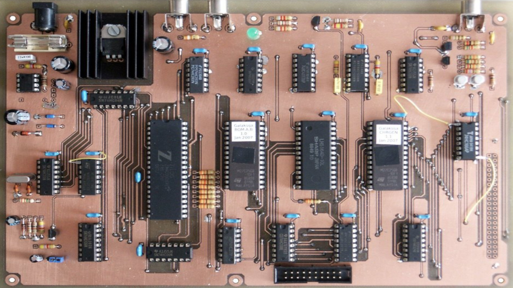

# Galaxy

### Description

Galaxy emulates the *Galaksija* built-it-yourself computer designed by Voja Antonićin in Yogoslavia in 1983.

### License

Unlicensed

### Icon

### Fanart

### Screenshots

Help make me screenshots!

### Disclaimer

*Image credit: Tomaž Šolc*
